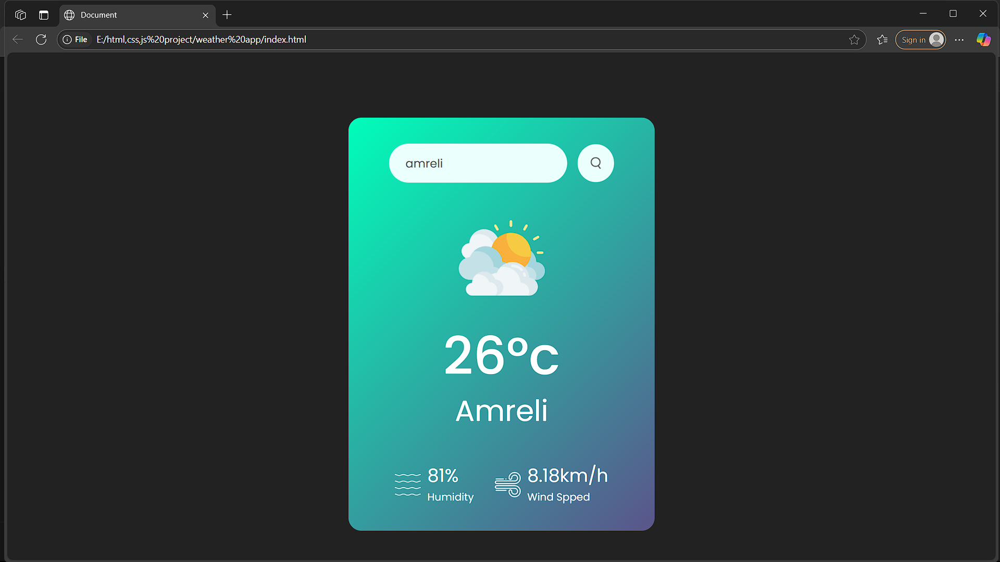

# 🌤️ Weather App

A simple and responsive weather application built using **HTML**, **CSS**, and **JavaScript**, which fetches real-time weather data using a public API.

---

## 🔗 Live Demo

👉 [View Website](https://bhavin-hariyani-001b.github.io/weather_app/)  

---

## ⚙️ Features

- 🔍 Search for any city
- 🌡️ View current temperature, humidity, weather description
- 🌇 Dynamic background or icons based on weather
- 📱 Responsive design for mobile and desktop

---

## 🚀 Technologies Used

- HTML5
- CSS3
- JavaScript (Vanilla)
- [OpenWeatherMap API](https://openweathermap.org/api) weather API

---
